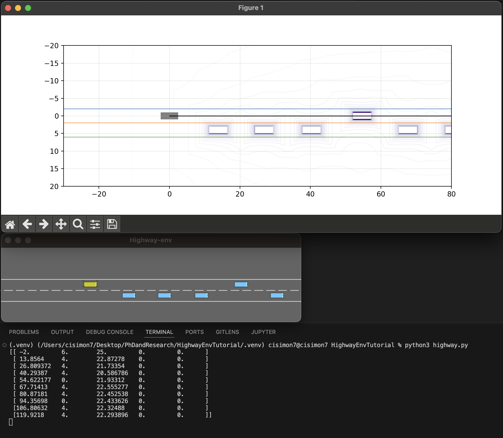

# <b>Setup HighwayEnv for Optimization class</b>
Starting code and Explanation for using the HighwayEnv gym Environment for optimization class

## <b>Setup and Installation</b>
Create a conda environment and activate:<br>
`conda create --prefix ./.venv -y`<br>
`conda activate ./.venv`

Or you can setup the environment to your own convenience. 

Then install the dependencies using the command:<br>
`pip install -r requirements.txt`

## <b>Observation configuration</b>
The configurations and setup sets the observation to return the positions of other vehicles relative to the ego vehicle while the velocities and heading angles are all absolute values.

The return observation is of shape 11 $\times$ 5. The 5 columns, in order, represents $[x, y, vx, vy, heading]$ for the vehicles. The rows represent different vehicles with the first being the ego vehicle.
However, the ego vehicle row, is a bit different from the other rows as the x column and y column rather is the lower and upper bound of the lanes respectively.

The plot below can be generated by simply running:<br>
`
python3 highway.py
`




## <b>Editing and testing your optimizer</b>
```python
for _ in range(500):
        
    # Action to be computed using your Optimizer based on observation
    action = [0, 0]     

    obs, reward, done, truncated, info = env.step(action)
    ego_state, obs = set_obs(obs, lane_ub, lane_lb)

    # Plot your generated trajectories here
    env_barrier.lines[0].set_data(np.arange(100), np.arange(100) * 0)

    env_barrier.step(
        th.from_numpy(ego_state), 
        th.from_numpy(obs[1:]), 
        lane_lb, lane_ub
    )
    env.render()
```

# LOTI.05.095-Assignment 2

Follow the setup instructions above.

Run the planner:

    python3 assignment.py

The planner defaults to CEM. To see available planners and their parameters, run:

    python3 assignment.py --help

